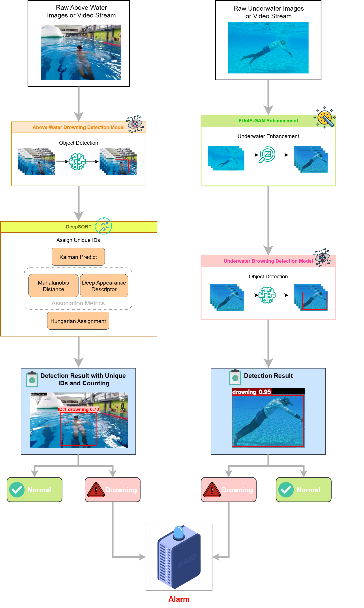

# 🛟 AI Drowning Detection System – Smart Pool Surveillance with Above & Underwater Vision

The AI Drowning Detection System is an intelligent surveillance solution designed to enhance pool safety by detecting potential drowning incidents in real time.
This system integrates computer vision, deep learning, and IoT-based alert mechanisms to automatically monitor both above-water and underwater environments.

It utilizes YOLO-based drowning detection powered by PyTorch, combined with FUnIE-GAN underwater image enhancement built with TensorFlow, to ensure clear visibility and accurate detection even in low-clarity underwater conditions.

Developed with FastAPI (backend) and ReactJS (frontend), the system offers real-time detection through webcam or uploaded media, an automated alarm system, and emergency response integration that locates and displays the nearest 5 emergency service centers for immediate rescue coordination.

This project demonstrates an end-to-end AI-driven safety and rescue system, simulating real-world pool surveillance applications for proactive drowning prevention and faster emergency response.



---

## 🧰 Prerequisites
Before getting started, ensure the following tools are installed on your system:

### A) Software Requirements:
<a href="https://www.python.org/downloads/" target="_blank" rel="noreferrer">
  
  <strong>Python</strong>
</a> – Required for the FastAPI backend, YOLO, and TensorFlow models.<br>  

<a href="https://nodejs.org/en" target="_blank" rel="noreferrer">
  
  <strong>Node.js</strong>
</a> – Required for the ReactJS frontend.<br>   

<a href="https://code.visualstudio.com/" target="_blank" rel="noreferrer">
  
  <strong>Visual Studio Code</strong>
</a> – Recommended IDE for editing and running the project.<br>    

<a href="https://colab.research.google.com/" target="_blank" rel="noreferrer">
  
  <strong>Google Colab</strong>
</a> – Used for model training and dataset experimentation.<br>  

<a href="https://www.roboflow.com" target="_blank" rel="noreferrer">
  
  <strong>Roboflow</strong>
</a> – For dataset collection, annotation, preprocessing, and augmentation.<br>  

<a href="https://www.ultralytics.com/hub" target="_blank" rel="noreferrer">
  
  <strong>Ultralytics Hub</strong>
</a> – Centralized platform for managing YOLO model training and datasets.<br>  

### B) Libraries and Tools:

<a href="https://opencv.org/" target="_blank" rel="noreferrer">
  
  <strong>OpenCV</strong>
</a> – Computer vision library for image and video processing.<br>  

<a href="https://pytorch.org/" target="_blank" rel="noreferrer">
  
  <strong>PyTorch</strong>
</a> – Deep learning framework used for YOLO model training and inference.<br><br>  

<a href="https://scikit-learn.org/" target="_blank" rel="noreferrer">
  
  <strong>Scikit-learn</strong>
</a> – Machine learning utilities for preprocessing and evaluation.<br>   

<a href="https://www.tensorflow.org/" target="_blank" rel="noreferrer">
  
  <strong>TensorFlow</strong>
</a> – Used for FUnIE-GAN underwater image enhancement.<br>    


### C) Hardware Requirements:
- NVIDIA GPU with CUDA support for faster YOLO and GAN model inference
- At least 4 GB VRAM (e.g., GTX 1050 Ti or higher)
  
---

## 📥 Installation You can get the project files in two ways: 
### 📌 Option 1: Clone via Git
```bash
# Clone the repository using Git
git clone ttps://github.com/zseng0912/Drowning-Detection-System.git

# Navigate into the project folder
cd your-repo-name
```

### 📌 Option 2: Download ZIP 
1. 🔗 Visit the repository on [GitHub](ttps://github.com/zseng0912/Drowning-Detection-System.git) 
2. ⬇️ Click on the green **"Code"** button
3. Select **"Download ZIP"**
4. 🗂️ Extract the ZIP file to your desired location
5. 📂 Open the extracted folder in your preferred code editor

--- 

## 🚀 Getting Started
### 1. Run FastAPI Backend
```bash
cd fastapi-backend

# Create a virtual environment
python -m venv <virtual_environment_name>

# Activate virtual environment (Windows)
<virtual_environment_name>\Scripts\activate

# Install dependencies
pip install -r requirements.txt

# Start FastAPI server
uvicorn main:app --host 0.0.0.0 --port 8000
```

### 2. Run Frontend (Drowning Detection System)
```bash
cd frontend

# Install Necessary Libraries
npm install 

# Start the app
npm run dev
```

---

## 🌟 Key Features

Unlock intelligent and automated pool monitoring powered by deep learning and real-time computer vision.

### 🧠 AI-Powered Drowning Detection
- Utilizes YOLO deep learning model trained via Roboflow and Ultralytics Hub for accurate drowning detection.
- Detects drowning incidents from both images and videos.
- Supports real-time detection using live webcam feed.

### 🌊 Underwater Image Enhancement
- Integrated with FUnIE-GAN (Fast Underwater Image Enhancement GAN) using TensorFlow.
- Enhances clarity and visibility for underwater video feeds to improve model performance.

### 🚨 Automated Alarm System
- Triggers an instant alarm alert when a drowning event is detected.
- Supports customizable alert mechanisms for pool operators or surveillance systems.

### 📸 Dual-View Monitoring
- Supports both above-water and underwater camera feeds for comprehensive pool surveillance coverage.
- Simulates a real-world smart pool monitoring environment.

### ⚡ Real-Time Detection Interface
- Built with FastAPI (Backend) and ReactJS (Frontend) for seamless data exchange.
- Allows users to upload files or use real-time webcam streaming directly from the dashboard.

### 🆘 Emergency Response Integration
- Automatically detects the current system location.
- Provides the top 5 nearest emergency service centers (hospitals, rescue stations, etc.) for rapid response.

### 🧪 Testing & Validation Tabs
- Dedicated sections for testing drowning detection and underwater enhancement functionalities.
- Ensures proper operation before real-world deployment.

---

## 📞 Support 
If you encounter any issues or bugs, feel free to create a GitHub issue or contact the maintainer.
